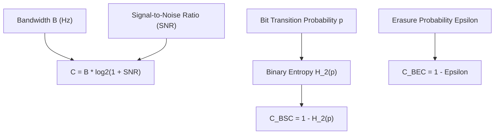

# genpark-shannon-entropy-channel-capacity-awgn-skill

Agent Skill implementing the **Shannon-Hartley Theorem and Channel Capacity Metrics** for AWGN channels, Binary Symmetric Channels (BSC), and Binary Erasure Channels (BEC).

## Architectural Overview

